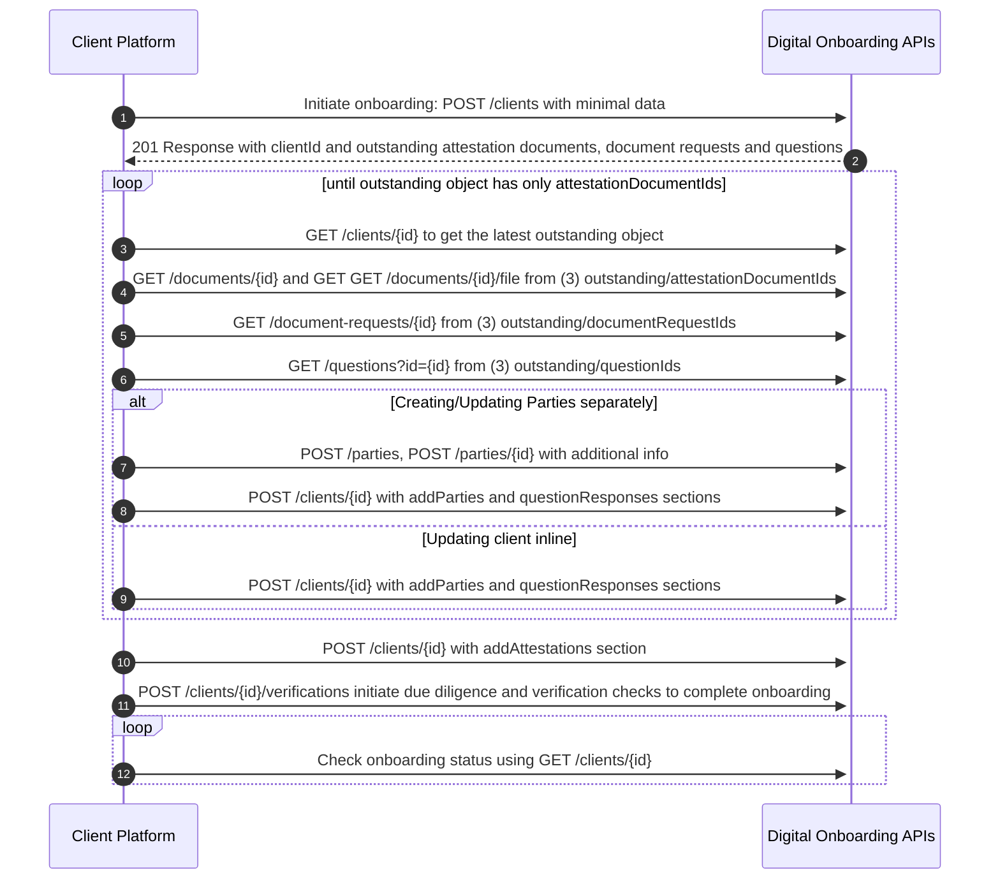
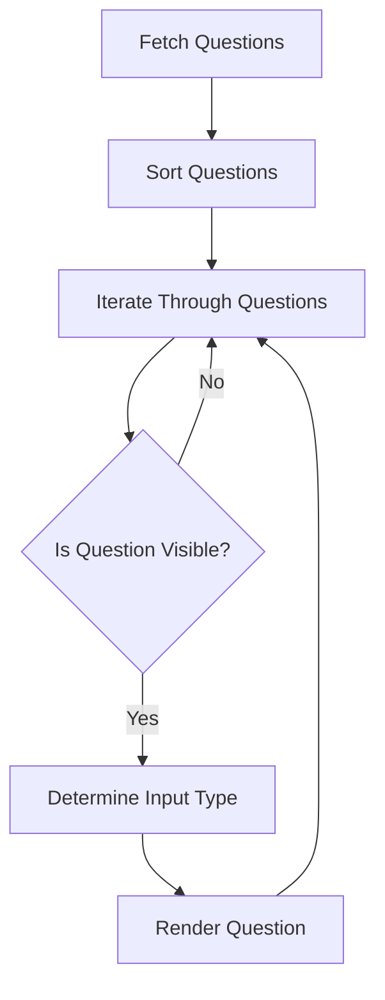

⚠️ DRAFT - UNDER REVIEW ⚠️

This document is a draft and is currently being updated. Information contained herein may be incomplete or subject to change.

# Digital Onboarding UI/UX Recipe

## APIs Workflows Recipes Background

API calls rarely comes alone. It's far common for a business capability to require a series of steps, overwise known as workflow. But how do you create a user-friendly and efficient digital experience specifically tailored to your business needs and getting to the value faster and with less effort?

There are multiple ways how API provider could help API consumer to develop a API workflows and get to value faster and with less efforts:

- Fully Hosted UI - API Provider/Creator of the Embedded Component is responsible for hosting the UI and the APIs and cover infrastructure and security risks. Ultimate component should be fully tested and certified for the production use.
- Runtime client or server side UI injection - iframes, server side composition, or client side composition (module federation)
- Embedded UI Components - build time UI injection - published as a npm package
- Sophisticated detailed UI/UX Recipe which provides human readable guidelines for implementing a React-based web application that leverages the Digital Onboarding APIs. This could include various flow diagrams, sequence diagrams, and other visual aids to help API consumers understand the process and how to implement it.
- Machine readable specification like [Arazzo](https://spec.openapis.org/arazzo/latest.html) which provides a structured way to describe the digital onboarding process and the APIs it uses.

Machine readable specification along with the recipes could be used with LLMs to quickly generate a skeleton/draft version of the digital experience. This can be done with any UI framework, library or other custom instruction set.

## Digital Onboarding Recipe Introduction

This recipe provides guidelines for implementing a React-based web application that leverages the Digital Onboarding APIs. There are multiple ways how complex forms can be implemented, but we recommend to use a stepper wizard layout. The wizard will guide the user through the onboarding process and provide feedback on the current step.
Advantages of the stepper wizard layout:

- Clear progression: Users can easily see their progress through the form.
- Reduced cognitive load: By breaking the form into manageable steps, users aren't overwhelmed by a long form.
- Improved focus: Users can concentrate on one section at a time.
- Better mobile experience: Each step can be optimized for mobile viewing.
- Easier error management: Errors can be addressed at each step before proceeding.

## Sequence Diagram



## Setup

1. Set up a new React project (Create React App or Next.js).
2. Install dependencies: `react-query`, `axios`, `react-hook-form` (or other form library), `yup` (or other JSON schema validation library), and components library of your choice (Mantine, shadcn, Material-UI, Ant Design, etc.).
3. We recommend to use Orval to generate React Query hooks and TypeScript types from the OpenAPI specification.

## Stepper Wizard Implementation

Create a main component with a wizard / stepper and individual step components. Use React state or create a context to manage the active step and client ID as well as synchronize the form data with the server state.

## Step 1: Intro

### API Operations

- Use the `POST /clients` endpoint to create a new client.

### Hooks

```typescript
const { mutate: createClient } = useCreateClient();
```

### UX Best Practices

- Implement form validation using Yup schema validation.
- Display clear error messages for invalid inputs.
- Use dropdown menus for fields with predefined options (e.g., business type, products) - options will be provided from the respective user guides or reference data APIs.
- Disable the "Next" button until all required fields are filled and valid (client side validation).

### Code Reference

[InitialForm.tsx (link)](./../src/core/OnboardingWizardBasic/InitialForm/InitialForm.tsx)

In the case that a client ID is not provided, we render the above form that will make a `POST /clients` call to create a new client with the minimum required fields.

## Step 2: Individual and Business Details

### API Operations

- Use `GET /clients/:id` to fetch existing client data.
- Use `POST /clients/:id` to update client information.

### Hooks

```typescript
const { data: clientData, isLoading } = useGetClient(clientId);
const { mutate: updateClient } = useUpdateClient();
```

### Update Party specifics

All update parties operations could be done inline useUpdateClient() hook with different attributes for different actions

- create a new party - omit the id or parentPartyId

```json
{
    "addParties": [{
        ...
    }]
}
```

- update an existing party

```json
{
    "addParties": [{
        "id": "id-of-the-party-to-be-updated",
        ...
    }]
}
```

- create a new related party

```json
{
    "addParties": [{
        "parentPartyId": "id-of-the-parent-party",
        ...
    }]
}
```

- remove a party

```json
{
    "addParties": [{
        "id": "id-of-the-party-to-be-removed",
        "status": "INACTIVE"
        ...
    }]
}
```

### Create utils to map API data to form data and vice versa

For instance, you can create a mapping of form field names to API request body. The below example shows how you can accomplish this with typescript and inferred types from combined form schemas.

```tsx
// TODO: add more form schemas here
export type OnboardingWizardFormValues = z.infer<typeof InitialFormSchema> &
  z.infer<typeof OrganizationStepFormSchema>;
export type OnboardingWizardFormFieldNames = keyof OnboardingWizardFormValues;

// Source of truth for mapping form fields to API fields
// Used for handling server errors and creating request bodies
export const partyFieldMap: Record<OnboardingWizardFormFieldNames, string> = {
  organizationName: 'organizationDetails.organizationName',
  organizationType: 'organizationDetails.organizationType',
  countryOfFormation: 'organizationDetails.countryOfFormation',
  email: 'email',
  yearOfFormation: 'organizationDetails.yearOfFormation',
};
```

Using the above mapping, here is how you can generate a request body from form data.

```tsx
function setValueByPath(obj: any, path: string, value: any) {
  const keys = path.split('.');
  keys.reduce((acc, key, index) => {
    if (index === keys.length - 1) {
      acc[key] = value;
    } else {
      acc[key] = acc[key] || (key.match(/^\d+$/) ? [] : {});
    }
    return acc[key];
  }, obj);
}

// Modify the request body with the form values at the specified partyIndex
export function generateRequestBody(
  formValues: Partial<OnboardingWizardFormValues>,
  partyIndex: number,
  arrayName: 'parties' | 'addParties',
  obj: Partial<CreateClientRequestSmbdo> | Partial<UpdateClientRequestSmbdo>
) {
  const formValueKeys = Object.keys(formValues) as Array<
    keyof OnboardingWizardFormValues
  >;
  formValueKeys.forEach((key) => {
    if (!partyFieldMap[key]) {
      throw new Error(`${key} is not mapped in fieldMap`);
    }
    const path = `${arrayName}.${partyIndex}.${partyFieldMap[key]}`;
    const value = formValues[key];

    setValueByPath(obj, path, value);
  });

  return obj;
}
```

Since the API request body and the response body are very similar, this mapping can be used bi-directionally. Here is an example of how to convert response data to form data, which you can use to pre-fill form fields.

```tsx
export function getValueByPath(obj: any, pathTemplate: string): any {
  const keys = pathTemplate.replace(/\[(\w+)\]/g, '.$1').split('.');
  return keys.reduce(
    (acc, key) => (acc && acc[key] !== undefined ? acc[key] : undefined),
    obj
  );
}

// Convert data of party (with the specified partyId) to form values
export function convertClientResponseToFormValues(
  response: ClientResponse,
  partyId?: string
): Partial<OnboardingWizardFormValues> {
  const formValues: Record<string, any> = {};

  Object.entries(partyFieldMap).forEach(([fieldName, path]) => {
    const partyIndex =
      response.parties?.findIndex((party) => party.id === partyId) ?? -1;

    const pathTemplate = `parties.${partyIndex}.${path}`;
    const value = getValueByPath(response, pathTemplate);
    if (value !== undefined) {
      formValues[fieldName] = value;
    }
  });

  return formValues;
}
```

The above mapping can have even more uses. You can use it to map errors from the API to specific form fields.

```tsx
export function translateApiErrorsToFormErrors(
  errors: ApiErrorReasonV2[],
  partyIndex: number,
  arrayName: 'parties' | 'addParties'
): FormError[] {
  const fieldMapKeys = Object.keys(partyFieldMap) as Array<
    keyof typeof partyFieldMap
  >;
  return errors.map((error) => {
    const matchedKey = fieldMapKeys.find(
      (key) =>
        `${arrayName}.${partyIndex}.${partyFieldMap[key]}` === error.field
    );
    if (!matchedKey && error.field && error.field in partyFieldMap) {
      return {
        field: error.field as keyof typeof partyFieldMap,
        message: error.message,
        path: error.field,
      };
    }
    return { field: matchedKey, message: error.message, path: error.field };
  });
}
```

You can then attach this error to the specific form field. Here is an example built for `react-hook-form`:

```tsx
export function setApiFormErrors(
  form: UseFormReturn<any>,
  apiFormErrors: FormError[]
) {
  let unhandledErrorString = '';
  let focused = false;
  apiFormErrors.forEach((formError) => {
    if (formError.field === undefined) {
      unhandledErrorString += `\n${formError.path}: ${formError.message}`;
    } else {
      form.setError(formError.field, {
        message: `Server Error: ${formError.message}`,
      });
      if (!focused) {
        form.setFocus(formError.field);
        focused = true;
      }
    }
  });
  if (import.meta.env.DEV && unhandledErrorString !== '') {
    toast.error(`[DEV] Unhandled Server Errors`, {
      description: unhandledErrorString,
      duration: Infinity,
      closeButton: true,
    });
  }
}
```

### UX Best Practices

- Pre-fill form fields with existing data from the API.
- Implement real-time validation as the user types.
- Use appropriate input types (e.g., date picker for birth date).
- Show a loading indicator while fetching client data.

## Steps 3 & 4: Business Owners and Decision Makers

### API Operations

- Use `POST /clients/:id` to update client information with related parties.

### Hooks

```typescript
const { mutate: updateClient } = useUpdateClient();
```

### UX Best Practices

- Will depend on the business type. For example, Sole Proprietorships will have a single owner, while Corporations or Partnerships could have multiple owners and additional decision makers. we recommend to ask a questions whether there are multiple owners or decision makers and then show the respective UI components.
- Allow adding multiple owners/decision makers dynamically.
- Implement a summary view of added parties with edit/delete options.
- Use consistent validation across all party forms.

## Step 5: Due Diligence Additional Questions

### API Operations

- Use `GET /clients/:id` to fetch outstanding questions.
- Use `GET /questions?questionIds=<comma-separated-question-ids>` to fetch question details.
- Use `POST /clients/:id` to submit question responses.

### Hooks

```typescript
const { data: clientData } = useGetClient(clientId);
const { data: questions } = useGetQuestions({
  questionIds: questionIds.join(','),
});
const { mutate: updateClient } = useUpdateClient();
```

### Question Rendering Logic

1. **Fetch Questions**: Retrieve both outstanding and previously answered questions.
2. **Sort Questions**: Order questions based on their dependencies (parent/child relationships).
3. **Render Questions**: Dynamically render each question based on its type and visibility conditions.

### Parent/Child Question Logic

Implement a visibility checker function:

```typescript
const isQuestionVisible = (question: Question, formValues: FormValues) => {
  if (!question.parentQuestionId) return true;

  const parentQuestion = questions.find(
    (q) => q.id === question.parentQuestionId
  );
  if (!parentQuestion) return false;

  const parentResponse = formValues[parentQuestion.id];
  const subQuestion = parentQuestion.subQuestions.find((sq) =>
    sq.questionIds.includes(question.id)
  );

  return evaluateCondition(subQuestion.anyValuesMatch, parentResponse);
};
```

### Question Field Format Derivation

Determine the input type based on the question's `responseSchema`:

| Response Schema               | Input Type    | Component               |
| ----------------------------- | ------------- | ----------------------- |
| BOOLEAN                       | Radio buttons | `<RadioGroup>`          |
| STRING with enum              | Dropdown      | `<Select>`              |
| STRING without enum           | Text input    | `<Input>`               |
| INTEGER                       | Number input  | `<Input type="number">` |
| DATE                          | Date picker   | Custom date picker      |
| ARRAY with multiple selection | Checkboxes    | `<Checkbox>` group      |

### Question Rendering Flow



### UX Best Practices

1. **Dynamic Rendering**: Render questions based on visibility conditions.
2. **Appropriate Input Types**: Use suitable input components for each question type.
3. **Conditional Logic**: Implement show/hide logic for child questions.
4. **Clear Instructions**: Provide concise instructions for each question.
5. **Validation**: Implement real-time validation based on `responseSchema`.
6. **Error Handling**: Display clear error messages for invalid inputs.
7. **Progress Indicator**: Show progress through the questionnaire.

### Handling Complex Question Types

For questions with complex response schemas (e.g., nested objects or arrays), consider creating custom components:

1. **Address Input**: Create a reusable address input component for questions requiring address details.
2. **Multi-select with "Other"**: Implement a checkbox group with an additional text input for "Other" options.
3. **Dependent Dropdowns**: For questions where one selection affects the options in another, implement cascading dropdowns.

### Implementation Example

```tsx
const renderQuestion = (question: Question, index: number) => {
  if (!isQuestionVisible(question, form.getValues())) return null;

  const fieldName = `questionResponses.${index}.values`;
  const inputType = deriveInputType(question.responseSchema);

  return (
    <FormField
      key={question.id}
      control={form.control}
      name={fieldName}
      render={({ field }) => (
        <FormItem>
          <FormLabel>{question.description}</FormLabel>
          <FormControl>
            {renderInputByType(inputType, field, question)}
          </FormControl>
          <FormMessage />
        </FormItem>
      )}
    />
  );
};

const renderQuestions = () => {
  if (!questions) return null;
  return questions.map((question, index) => renderQuestion(question, index));
};
```

## Step 6: Review and Attestation

### API Operations

- Use `GET /clients/:id` to fetch all client data for review.
- Use `POST /clients/:id` to submit attestations.

### Hooks

```typescript
const { data: clientData } = useGetClient(clientId);
const { mutate: updateClient } = useUpdateClient();
```

---

## Attestation

- Use `GET /clients/:id` to fetch all client data for to find out the outstanding attestionDocumentIds.
  -- A list of of documents that needs to be engaged with.
- Use `GET /documents/${id}` to fetch a list of documents that are required for the client
- Use `/documents/${id}/file` to download the document, the document is binary, and required to be converted to BLOB via intercept, or any logical way that return responseType = blob

```typescript
AXIOS_INSTANCE.interceptors.request.use(
  (config: any) => {
    if (config.url.includes('/file')) {
      config.responseType = 'blob';
    }

    return config;
  },
  (error) => {
    return Promise.reject(error);
  }
);
```

```typescript
const newBlob = new Blob([downloadDocument], {
  type: 'application/pdf',
});
const urlBlob = URL.createObjectURL(newBlob);
```

### Hooks

```typescript
const { data: clientData } = useGetClient(clientId);
const { mutate: updateClient } = useSmbdoGetDocumentDetail(attestionDocumentId);
const { data: downloadDocument } = useSmbdoDownloadDocument(
  termsAndConditionsDocId
);
```

### UX Best Practices

- Present a clear summary of all provided information.
- Highlight any missing or incomplete information.
- Allow users to navigate back to previous steps to make changes.
- Clearly explain the attestation process and its implications.
- Use checkboxes for each attestation item.

## Step 7: Trigger Verification

### API Operations

- Use `POST /clients/:id/verifications` to trigger KYC process.
- Use `GET /clients/:id` to fetch updated client status.

### Hooks

```typescript
const { mutate: triggerVerification } = useTriggerVerification();
const { data: clientData } = useGetClient(clientId);

triggerVerification();
```

### UX Best Practices

- Clearly communicate that this is the final step and no further edits will be possible.
- Show a progress indicator during the verification process.
- Display the current client status and any required additional documents.
- Provide clear instructions for next steps based on the verification outcome.

## General UX Best Practices

1. Implement consistent error handling and display across all steps of the onboarding process.
2. Use loading indicators for all asynchronous operations to provide visual feedback to users.
3. Implement auto-save functionality to prevent data loss. Consider using an optional save data modal in case of browser refreshes or when the tab is closed.
4. Provide a clear and easily accessible way for users to exit the onboarding process while saving their progress.
5. Use clear, concise, and user-friendly language throughout the onboarding process to ensure understanding.
6. Implement responsive design to ensure a smooth experience across various device sizes and types.
7. Provide tooltips or contextual help text for complex fields or concepts to assist users in completing the form accurately.
8. Use progress indicators to show the overall completion status of the onboarding process, helping users understand their position in the journey.
9. Implement analytics to track user progress, identify potential pain points, and continually improve the onboarding experience.
10. Incorporate accessibility (a11y) considerations throughout the onboarding process. This includes:
    - Providing alternative text for images
    - Using descriptive labels for form fields
    - Ensuring the process is fully navigable using keyboard shortcuts
    - Maintaining sufficient color contrast for readability
    - Supporting screen readers with appropriate ARIA attributes
11. Address internationalization (i18n) requirements in the onboarding process:
    - Provide translations for all labels, instructions, and error messages
    - Support multiple languages throughout the onboarding journey
    - Use appropriate date, time, and number formats for different locales
    - Consider cultural differences in design and content presentation
12. Implement field-level validation in real-time to provide immediate feedback to users as they complete the form.
13. Offer a "Save and Continue Later" option to accommodate users who may need to complete the process in multiple sessions.
14. Provide clear next steps or a summary page upon completion of the onboarding process.
15. Use visual cues (such as icons or color-coding) consistently to indicate required fields, errors, or successful validations.

## API Error Handling

- Anticipate server-side errors and display user-friendly error messages based on API error responses.
- Provide guidance on how to resolve common errors.
- In case of long complex forms, summarize and repeat client side validation errors near the Next step (or other CTA) button to avoid missing important information.

Example error handling:

```typescript
try {
  await updateClient({ id: clientId, data: formData });
} catch (error) {
  if (error.response && error.response.status === 400) {
    // Handle validation errors
    const validationErrors = error.response.data.reasons;
    // Update form error state with validation errors
  } else {
    // Handle other types of errors
    console.error('An error occurred:', error);
    // Show a generic error message to the user
  }
}
```

By following these guidelines and best practices, you can create a user-friendly and efficient digital onboarding process that leverages the power of the provided APIs while providing a smooth user experience.
