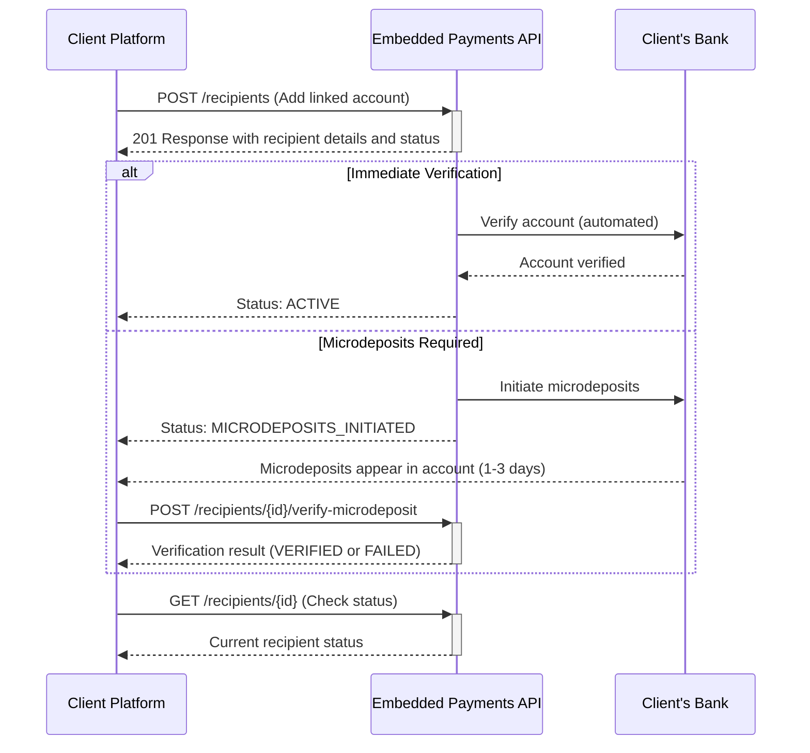

⚠️ DRAFT - UNDER REVIEW ⚠️

This document is a draft and is currently being updated. Information contained herein may be incomplete or subject to change.

# Linked Accounts API Workflow Recipe

## Introduction

This recipe provides guidelines for implementing linked account functionality in a React-based web application using the Embedded Payments API. The process involves adding a client's external bank account and verifying it through microdeposits when necessary.

## Sequence Diagram



## Setup

1. Set up a new React project (Create React App or Next.js).
2. Install dependencies: `react-query`, `axios`, `react-hook-form`, `yup` (or equivalent libraries).
3. Use Orval to generate React Query hooks and TypeScript types from the OpenAPI specification.

## Step 1: Add Linked Account

### API Operations

- Use the `POST /recipients` endpoint to add a new linked account.

### Hooks

```typescript
const { mutate: addLinkedAccount } = useAddLinkedAccount();
```

### UX Best Practices

- Implement form validation for account details (routing number, account number, etc.).
- Display clear error messages for invalid inputs.
- Use masked input for sensitive information like account numbers.
- Clearly explain the purpose of linking an account and how it will be used.

### Implementation Example

```tsx
const AddLinkedAccountForm = () => {
  const form = useForm({
    defaultValues: {
      accountNumber: '',
      routingNumber: '',
      accountType: 'CHECKING',
      // ... other fields
    },
    resolver: yupResolver(linkedAccountSchema),
  });

  const { mutate: addLinkedAccount } = useAddLinkedAccount();

  const onSubmit = (data) => {
    addLinkedAccount({
      clientId: currentClientId,
      partyId: currentPartyId,
      account: {
        number: data.accountNumber,
        type: data.accountType,
        routingNumber: data.routingNumber,
        // ... other fields
      },
      recipientType: 'LINKED_ACCOUNT',
    });
  };

  return (
    <form onSubmit={form.handleSubmit(onSubmit)}>
      {/* Render form fields */}
    </form>
  );
};
```

## Step 2: Handle Verification Status

### API Operations

- Use the response from `POST /recipients` to determine the verification status.
- Use `GET /recipients/{id}` to check the current status of a recipient.

### Hooks

```typescript
const { data: recipientStatus } = useGetRecipientStatus(recipientId);
```

### UX Best Practices

- Display the current verification status to the user.
- If microdeposits are initiated, clearly explain the process and next steps to the user.
- Provide an estimated timeframe for when microdeposits will appear (1-3 days).

### Implementation Example

```tsx
const VerificationStatus = ({ recipientId }) => {
  const { data: status } = useGetRecipientStatus(recipientId);

  if (status === 'ACTIVE') {
    return <div>Your account has been verified and is ready to use.</div>;
  }

  if (status === 'MICRODEPOSITS_INITIATED') {
    return (
      <div>
        <p>We've initiated two small deposits to your account for verification.</p>
        <p>These should appear in your account within 1-3 business days.</p>
        <p>Once you see them, please return here to complete the verification process.</p>
      </div>
    );
  }

  // Handle other statuses...
};
```

## Step 3: Verify Microdeposits

### API Operations

- Use `POST /recipients/{id}/verify-microdeposit` to submit microdeposit amounts.

### Hooks

```typescript
const { mutate: verifyMicrodeposits } = useVerifyMicrodeposits();
```

### UX Best Practices

- Clearly explain how to find and enter the microdeposit amounts.
- Use appropriate input validation for currency amounts.
- Display the number of remaining attempts (max 3).
- Provide clear feedback on verification success or failure.

### Implementation Example

```tsx
const VerifyMicrodepositsForm = ({ recipientId }) => {
  const form = useForm({
    defaultValues: {
      amount1: '',
      amount2: '',
    },
    resolver: yupResolver(microdepositsSchema),
  });

  const { mutate: verifyMicrodeposits } = useVerifyMicrodeposits();

  const onSubmit = (data) => {
    verifyMicrodeposits({
      recipientId,
      amounts: [parseFloat(data.amount1), parseFloat(data.amount2)],
    });
  };

  return (
    <form onSubmit={form.handleSubmit(onSubmit)}>
      <p>Enter the two microdeposit amounts you received in your account:</p>
      {/* Render input fields for amount1 and amount2 */}
      <button type="submit">Verify Amounts</button>
    </form>
  );
};
```

## General UX Best Practices

1. Provide clear instructions at each step of the process.
2. Use loading indicators for all asynchronous operations.
3. Implement error handling and display user-friendly error messages.
4. Offer a way for users to contact support if they encounter issues.
5. Use responsive design to ensure a good experience on all devices.
6. Implement proper form validation and provide instant feedback.
7. Consider offering a FAQ section to address common questions about linked accounts and the verification process.

## API Error Handling

- Handle specific error codes from the API and display appropriate messages to the user.
- Provide guidance on how to resolve common errors (e.g., incorrect account numbers, verification failures).

Example error handling:

```typescript
try {
  await verifyMicrodeposits({ recipientId, amounts });
} catch (error) {
  if (error.response?.status === 400) {
    // Handle validation errors
    const errorMessage = error.response.data.message;
    // Display error message to the user
  } else if (error.response?.status === 404) {
    // Handle case where recipient is not found
    // Maybe prompt the user to add the account again
  } else {
    // Handle other types of errors
    console.error('An error occurred:', error);
    // Show a generic error message to the user
  }
}
```

By following these guidelines and best practices, you can create a user-friendly and efficient linked account management process that leverages the power of the Embedded Payments API while providing a smooth user experience.